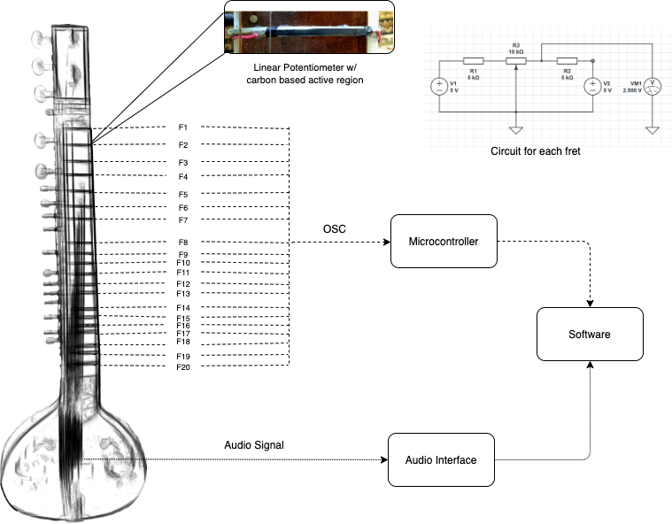

# Augmented-Sitar
Optimizing an Augmented Sitar for Greater Expressive Control

## Overview
The aim of this project is to develop an Augmented Musical Instrument (AMI) based on the sitar by installing sensors, processing and mapping data using the Bela platform. The instrument is designed to extend the sonic capabilities of the traditional sitar, a popular stringed melodic instrument primarily used in the Hindustani classic music tradition. The novel aspect of the system is the usage of an array of linear potentiometer sensors on top of the instrument frets in order to capture continuous, expressive information upon bending the main melody string (an idiosyncratic gesture associated with the sitar).

## Augmented Music Instrument
Augmented Musical Instruments (AMIs) are created by the application of sensor technology, among other forms, for the purpose of modifying or augmenting a traditional instrument’s set of affordances and sonic capabilities.

## The Sitar
The sitar is a fretted string instrument from India, and is predominantly used in the Hindustani classical music tradition. Primarily a melodic instrument, the first string from the bottom is the one that’s mainly used for expressing melody, often referred to as the main string. One of the most distinctive features about the instrument is that there is a lot of room for bending the main string for nuanced and elaborate melody production. My project essentially utilizes this aspect, and I’m basically trying to capture this continuous bend information along each fret using linear potentiometer sensors, and then use the information as control values that can be used to control other devices, soft synths, etc. In doing so, a greater amount of timbral control is possible, much more than the traditional sitar could offer, and hence the term Augmented Sitar. 

## Hardware
A linear potentiometer sensor is placed on each fret and it measures the position of the main string along the fret. This happens because a voltage divider circuit is created along each fret, and changing the position of the string along the fret changes the resistance of the sensor resistor, thus generating variable voltage output. Voltage values read by the Bela Beaglebone Black across all frets are sampled and sent all at the same time as UDP packets (a communication protocol) to Max/MSP. As for the choice of sensor, the carbon-based resistive area of a SoftPot Membrane Potentiometer by Spectra Symbol was used for the majority of the project. This material is merely a stopgap until a more suitable solution (for instance, conductive plastic-based 3D printed frets) is obtainable.

  Hardware Design                        |  Sensors on Frets
:---------------------------------------:|:---------------------------------------:
 |  

//
//

## Software
Fret values sent to Max are passed through pre-processing, wherein range of values are detected, standardized and scaled for 14 bit representation. Values corresponding to frets not in contact with the main string are filtered out, and eventually the fret index and corresponding fret value is obtained. 

## Mappings
Fret values obtained are routed according to the detected fret index. In this way, each fret can be mapped to different controllable parameters such as a reverb plug-in’s decay time, or pitch values of a synth in a DAW, allowing for 1-to-1, 1-to-many, many-to-many mappings.

## Envelope Tracking
A M4L envelope follower device is used to track the audio signal envelope, which then controls the output level and envelope characteristics of the generated synth sound.

## Future Work
- 3D print frets with a conductive plastic-based material and test reliability, consistency, durability, and smoothness. This would supersede the use of sensors that are meant to be physically installed onto the frets, thus reducing hindrances to the performer's natural set of gestures.

- Make processing in Max more efficient to obtain lower latency.

